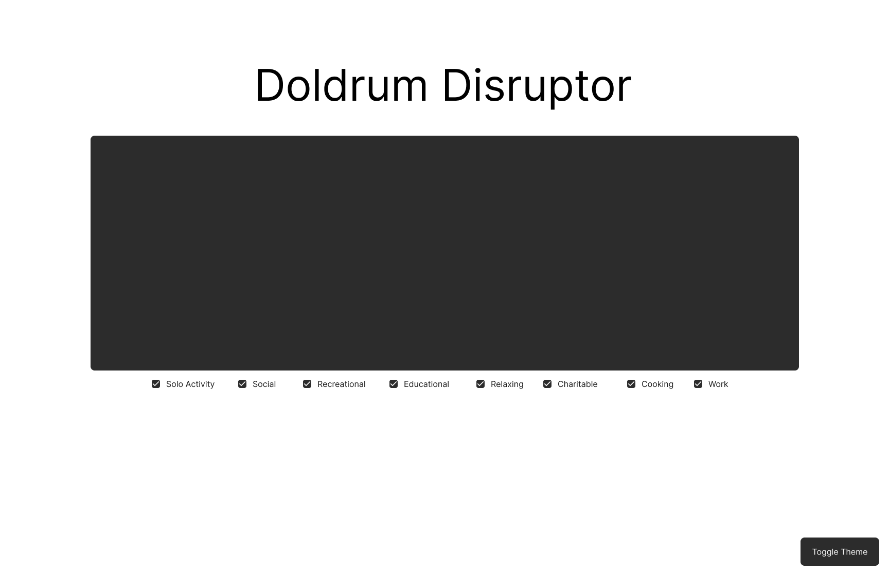

# CoderAcademy Hackathon Project: Doldrum Disruptor

## What does Doldrum Disruptor even mean?

The word "doldrums" refers to a state or period stagnation or depression, while a "distruptor" is something that prevents another thing (most commonly a system, process, or event) from occuring as expected. Put them together, (minus the s because I think it sounds better) and you are left with the Doldrum Disruptor, a disruption in the state of stagnation of a person.

## Why Doldrum Disruptor?

This year I have personally been trying to refrain from immediately scrolling on socia media apps via my phone as soon as I get bored, especially when I am with my partner, as I quickly become disengaged and we end up spending less quality time together. As a result, I have found that there is no longer a quick fix to my boredom, which I believe is a good thing as it challenges me to come up with new ways to pass time. Since I am studying this year and don't have as much disposible income as I did when I was working, however, I find it difficult sometimes to come up with creative and cost-effective pastimes. Because of this, I came up with the idea to create a project that can give me ideas for things to do both by myself and with my partner/others, that also matches the constraints mentioned previously.

## Inital Rough Wireframe

