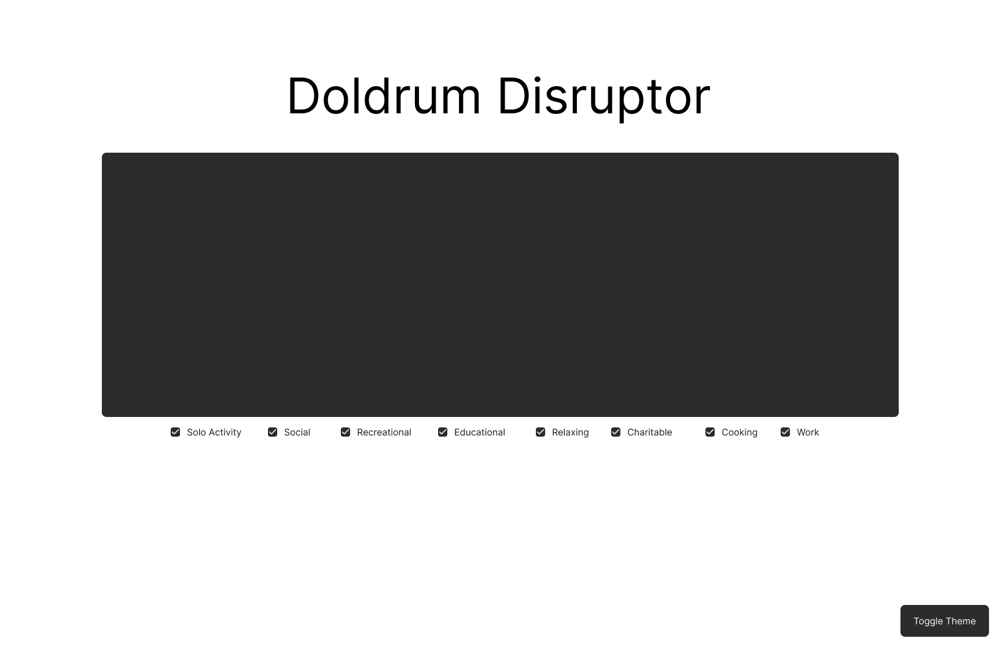
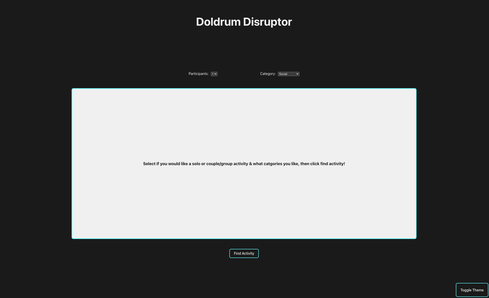
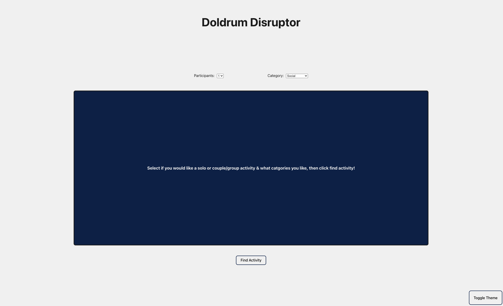
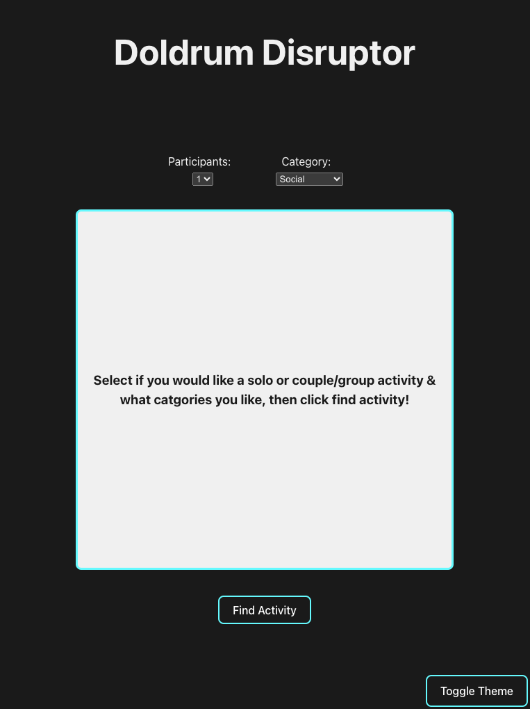
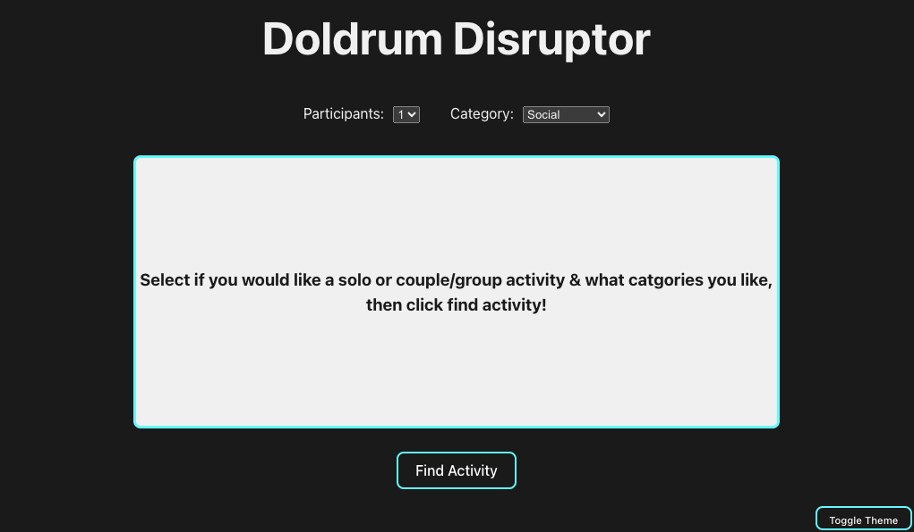
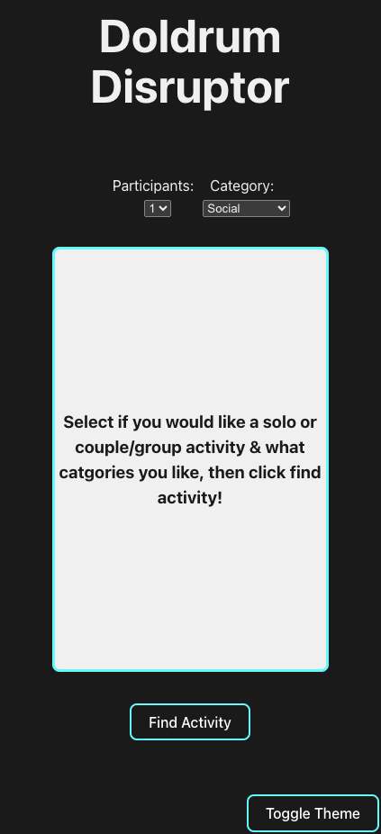

# CoderAcademy Hackathon Project: Doldrum Disruptor

#### Deployed Site URL (Turn off CORS for functionality, see "An important note on using Doldrum Disruptor" section for more details.)
https://doldrumdisruptor.netlify.app/

#### Video Presentation
https://youtu.be/Qk_E2bJQIUE

## What does Doldrum Disruptor even mean?

The word "doldrums" refers to a state or period stagnation or depression, while a "distruptor" is something that prevents another thing (most commonly a system, process, or event) from occuring as expected. Put them together, (minus the s because I think it sounds better) and you are left with the Doldrum Disruptor, a disruption in the state of stagnation of a person.

## Why Doldrum Disruptor?

This year I have personally been trying to refrain from immediately scrolling on socia media apps via my phone as soon as I get bored, especially when I am with others, as I quickly become disengaged. As a result, I have found that there is no longer a quick fix to my boredom, which I believe is a good thing as it challenges me to come up with new ways to pass time. Since I am studying this year and don't have as much disposible income as I did when I was working, however, I find it difficult sometimes to come up with creative and cost-effective pastimes. Because of this, I came up with the idea to create a project that can give me ideas for things to do both by myself and with others, that also matches the constraints mentioned previously.

## An important note on using Doldrum Disruptor

Unfortunately, CORS (Access-Control-Allow-Origin) which is a browser security protocol, will block requests from [the API that is utlised by this website by default](https://bored-api.appbrewery.com/). Due to time constraints and little experience in the topic so far, I have been unable to set up a proxy solution that is free, and as a result have made use of a chrome browser extension that bypasses this issue. The extension I am using is called ["Allow CORS: Access-Control-Allow-Origin"](https://chromewebstore.google.com/detail/allow-cors-access-control/lhobafahddgcelffkeicbaginigeejlf?hl=en), but there are likely many more extensions that perform the same functionality. Within the extension, you toggle allow CORS to on, which bypasses the issue and the website will work. 

**It should be noted that CORS is an important browser safety tool, and you should only allow the CORS extension to bypass CORS when using this site. Turn the extension off once your time using this project concludes!**

## Inital Rough Wireframe

Above is the initial rough wireframe that I designed for the look of the website. Thankfully I didn't spend too much time on this, as multiple changes had to be made due to unforseen constraints and different design choices further down the line. It did serve well as a quick guide to the direction I wanted to go, however.

## Completed Project

Below listed are some screenshots from the completed website. Overall, I am very happy with the completion of this project for the Coder Academy Hackathon, especially considering I completed it in less than a full week. Built using React + Vite and making use of an external API, this project has has taught me lots about the React library, as well as asyncronous javascript and using APIs. On top of this, I have learnt a lot about CORS and its role in web safety, as well as how it can effect web development. If I continue this project further, I would like to find a more permanent and practical solution to the CORS blocking issue, along with creating a more appealing UI.

